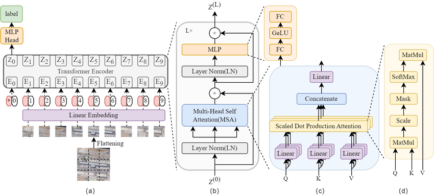
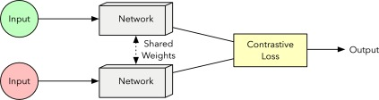
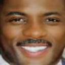
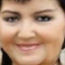
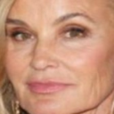
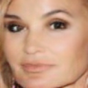
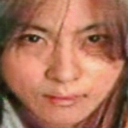
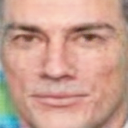

# A Unified Framework for Age-Invariant Face Recognition Using GANs and Vision Transformers

**Published Paper:** [IEEE Xplore: A Unified Framework for Age-Invariant Face Recognition Using GANs and Vision Transformers](https://ieeexplore.ieee.org/abstract/document/11498595)

This repository contains the project code for tackling the challenge of age-invariant face recognition (AIFR). Significant facial changes over time degrade the accuracy of standard biometric systems. Existing methods that rely independently on synthetic aging, feature disentanglement, or contrastive alignment often fail to generalize across diverse datasets. This project introduces a unified deep learning framework designed to achieve image realism, robust identity representation, and cross-dataset generalization.

## Architectures

Our unified framework leverages three powerful architectures to build a robust AIFR pipeline:

### 1. CycleGAN (Synthetic Age Simulation)
We utilize a CycleGAN-based module to generate realistic age-progressed and age-regressed images without relying on explicit age labels. This bidirectionally translates between younger and older face domains while preserving the core identity.

*(Note: Please ensure this image exists at `img/cycle_gan_architecture.png`)*

### 2. Vision Transformers & CNN Backbones (Deep Feature Extraction)
The augmented images are processed through multiple backbone architectures to capture both local textures and global facial structures. Evaluated models include ResNet18, VGG19, EfficientNet-B0, and the **Vision Transformer (ViT-B/16)**.

*(Note: Please ensure this image exists at `img/vit_architecture.png`)*

### 3. Siamese Network (Contrastive Representation Learning)
To learn age-invariant representations, we use a Siamese network with shared weights. Each branch extracts embeddings via a frozen pretrained backbone, mapping them to a lower-dimensional space using an MLP projection head. The network is trained using contrastive loss to pull together same-identity pairs across age gaps and push apart different identities.

*(Note: Please ensure this image exists at `img/siamese_network_architecture.png`)*

## Methodology & Pipeline Integration

The pipeline functionally integrates these components into a cohesive workflow:
1. **Augmentation:** UTKFace dataset images are augmented via CycleGAN to enhance age diversity, particularly for underrepresented demographic groups (children and elderly).
2. **Feature Extraction:** Preprocessed images pass through our frozen backbones.
3. **Similarity Estimation:** Contrastively trained embeddings are used by a lightweight binary MLP classifier to predict if two images belong to the same identity, regardless of age variations.

## Results and Generalization

The performance of this unified framework was evaluated in a zero-shot setting on the FG-NET dataset to test real-world robustness against a non-unified baseline.

*   **Non-Unified Baseline Limitations:** A baseline pipeline trained on the MORPH dataset achieved 98.92% (ResNet152) and 99.14% (EfficientNet-B0) local accuracy. However, under zero-shot generalization on the unseen FG-NET dataset, performance plummeted to 53.49% and 52.89%, respectively.
*   **Unified Framework Improvements:** The proposed unified framework, trained on UTKFace, maintained a zero-shot accuracy of **80.55%** (EfficientNet-B0) and **80.08%** (ViT-B/16) when tested on FG-NET. This integrated approach reduced the cross-dataset generalization gap by over 27%.

## Age Transformation Examples

The unified framework utilizes GANs for bidirectional age translation to enrich the dataset. Below are sample synthetic transformations mapping older subjects to younger profiles and vice versa.

### Old to Young
| Original (Old) | Generated (Young) |
| :---: | :---: |
|  |  |
|  |  |
|  |  |
|  |  |

### Young to Old
| Original (Young) | Generated (Old) |
| :---: | :---: |
|  |  |
|  |  |
|  |  |
|  |  |
